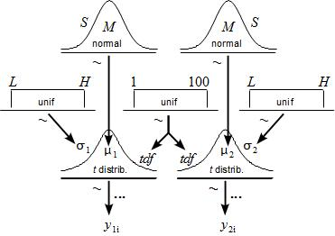
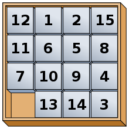

## Projects

---

[Causation Entropy Library](https://github.com/Center-For-Complex-Systems-Science/causationentropy)
[Documentation](https://causationentropy.readthedocs.io/)
  

---

[Matrix Theory: Field of Values/Numerical Range](https://github.com/kslote1/field-of-values)

  

---

[Morris-Lecar Neuronal Model](https://github.com/kslote1/hopf-bifurcations)

---

[Bayesian T-Testing](https://github.com/kslote1/bayesian-t-test)

  

---

[Brownian Bridges](https://github.com/kslote1/brownian-bridge)

 

---

[Finite Potential Wells](https://github.com/kslote1/finite-potential-well)

---

[Redheffer Matrix](https://github.com/kslote1/Redheffer_matrix)

---

[Quantum Support Vector Machines](https://github.com/kslote1/quantum-svm)

  

---

[Brains and Behaviour Epilepsy Presentation](/pdf/bb_poster.pdf)
  

---
[Groupoid Reinforcement Learning](https://github.com/EleutherAI/groupoid-rl)

  

---
## Publications

How advocacy groups on Twitter and media coverage can drive US firearm acquisition: A causal study
Kevin Slote, K Daley, R Succar, R Barak Ventura, M Porfiri, I Belykh
PNAS nexus 4 (6), pgaf195
[PNAS Nexus](https://academic.oup.com/pnasnexus/article/4/6/pgaf195/8160866)

Online Performance Estimation with Unlabeled Data: A Bayesian Application of the Hui-Walter Paradigm
Kevin Slote, Elaine Lee Lecture Notes in Networks and Systems 1285, 529-553
[Open Access](https://arxiv.org/abs/2401.09376)

## Patents

[Systems and Methods for Attacks, Countermeasures, Archiving, Data Leak Prevention, and Other Novel Services for Active Messages
](https://patents.justia.com/patent/20220197997) ** Patent Pending

## Presentations

### Posters

  

---

Page template forked from <a href="https://github.com/evanca/quick-portfolio">evanca</a>

<!-- Remove above link if you don't want to attibute -->
