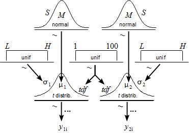
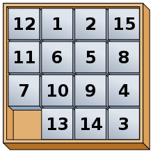
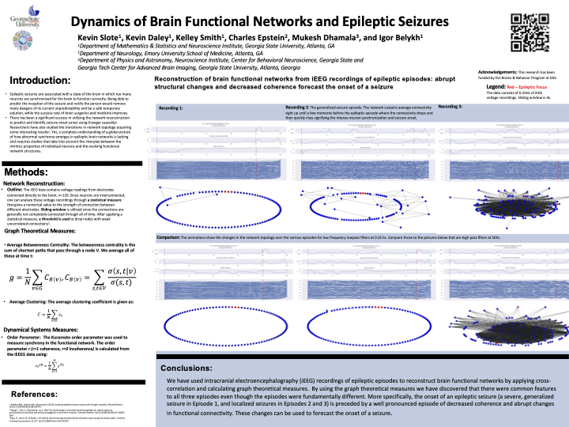

## Recent Media

<a href="https://www.siam.org/publications/siam-news/articles/optimal-causation-entropy-for-the-next-generation/" target="_blank" rel="noopener noreferrer" style="display:block; max-width:480px; text-decoration:none; color:inherit; background:#ffffff; border:1px solid rgba(0,0,0,0.12); border-radius:12px; overflow:hidden; font-family:-apple-system,BlinkMacSystemFont,'Segoe UI',Roboto,Helvetica,Arial,sans-serif;">
  
    <svg viewBox="0 0 200 100" style="width:70%; height:70%; vertical-align:middle;" aria-hidden="true">
      <line x1="40" y1="30" x2="100" y2="55" stroke="#999" stroke-width="1"/>
      <line x1="100" y1="20" x2="100" y2="55" stroke="#999" stroke-width="1"/>
      <line x1="160" y1="35" x2="100" y2="55" stroke="#999" stroke-width="1"/>
      <line x1="60" y1="75" x2="100" y2="55" stroke="#999" stroke-width="1"/>
      <line x1="140" y1="80" x2="100" y2="55" stroke="#999" stroke-width="1"/>
      <line x1="40" y1="30" x2="60" y2="75" stroke="#bbb" stroke-width="1" stroke-dasharray="2 2"/>
      <line x1="160" y1="35" x2="140" y2="80" stroke="#bbb" stroke-width="1" stroke-dasharray="2 2"/>
      <circle cx="40" cy="30" r="8" fill="#7F77DD"/>
      <circle cx="100" cy="20" r="8" fill="#1D9E75"/>
      <circle cx="160" cy="35" r="8" fill="#D85A30"/>
      <circle cx="60" cy="75" r="8" fill="#378ADD"/>
      <circle cx="140" cy="80" r="8" fill="#EF9F27"/>
      <circle cx="100" cy="55" r="9" fill="#5F5E5A"/>
    </svg>
  
  
    
      <svg viewBox="0 0 24 24" width="14" height="14" fill="none" stroke="currentColor" stroke-width="2" stroke-linecap="round" stroke-linejoin="round" style="vertical-align:-2px; margin-right:4px;" aria-hidden="true"><circle cx="12" cy="12" r="9"/><path d="M3.6 9h16.8M3.6 15h16.8M12 3a14 14 0 0 1 0 18M12 3a14 14 0 0 0 0 18"/></svg>
      siam.org · SIAM News
    
    Optimal Causation Entropy for the Next Generation
    An overview of optimal causation entropy (oCSE) — an information-theoretic method for inferring causal networks from time series data, distinguishing direct from indirect influences.
    
      Open article
      <svg viewBox="0 0 24 24" width="13" height="13" fill="none" stroke="currentColor" stroke-width="2" stroke-linecap="round" stroke-linejoin="round" style="vertical-align:-2px; margin-left:2px;" aria-hidden="true"><path d="M18 13v6a2 2 0 0 1-2 2H5a2 2 0 0 1-2-2V8a2 2 0 0 1 2-2h6"/><path d="M15 3h6v6"/><path d="M10 14L21 3"/></svg>
    
  
</a>

## Projects

---

[Causation Entropy Library](https://github.com/Center-For-Complex-Systems-Science/causationentropy)
[Documentation](https://causationentropy.readthedocs.io/)
  

---

[Matrix Theory: Field of Values/Numerical Range](https://github.com/kslote1/field-of-values)

  

---

[Morris-Lecar Neuronal Model](https://github.com/kslote1/hopf-bifurcations)

---

[Bayesian T-Testing](https://github.com/kslote1/bayesian-t-test)

  

---

[Brownian Bridges](https://github.com/kslote1/brownian-bridge)

 

---

[Finite Potential Wells](https://github.com/kslote1/finite-potential-well)

---

[Redheffer Matrix](https://github.com/kslote1/Redheffer_matrix)

---

[Quantum Support Vector Machines](https://github.com/kslote1/quantum-svm)

  

---

[Brains and Behaviour Epilepsy Presentation](/pdf/bb_poster.pdf)
  

---
[Groupoid Reinforcement Learning](https://github.com/EleutherAI/groupoid-rl)

  

---
## Publications

How advocacy groups on Twitter and media coverage can drive US firearm acquisition: A causal study
Kevin Slote, K Daley, R Succar, R Barak Ventura, M Porfiri, I Belykh
PNAS nexus 4 (6), pgaf195
[PNAS Nexus](https://academic.oup.com/pnasnexus/article/4/6/pgaf195/8160866)

Online Performance Estimation with Unlabeled Data: A Bayesian Application of the Hui-Walter Paradigm
Kevin Slote, Elaine Lee Lecture Notes in Networks and Systems 1285, 529-553
[Open Access](https://arxiv.org/abs/2401.09376)

## Patents

[Systems and Methods for Attacks, Countermeasures, Archiving, Data Leak Prevention, and Other Novel Services for Active Messages
](https://patents.justia.com/patent/20220197997) ** Patent Pending

## Presentations

### Posters

  

---

Page template forked from <a href="https://github.com/evanca/quick-portfolio">evanca</a>

<!-- Remove above link if you don't want to attibute -->
